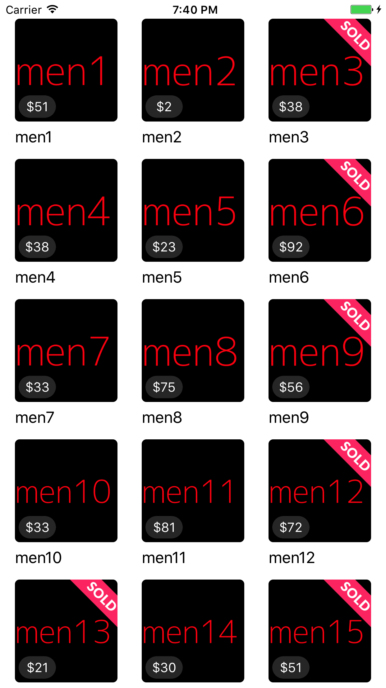

<<<<<<< HEAD
# mercari-ios-test
For Technical interview

## Description

- Build an app that loads data from `all.json` which is stored in main bundle, and make the app look like the above screenshot.
- Write in a such way that data retrieval implementation can be easily replaced. For example, it is currenly loaded from all.json file but in the near future we might want to fetch the data from network.
- In the collection cell view, it needs to display item image from photo, title from name, and price from price.
- You are encouraged to use Swift.
- You are encouraged to use ReactiveSwift.
display sold.png as shown when Item.status equals to sold_out.
- Even though this app is relatively simple, please write code in "production ready" level; that is, write in a way that you would normally do on production app.
- Basic unit tests for bonus points
- Please use a known architecture with justification for your choice included
- When you have questions, please don't hesitate to ask!

************************************************
    Ehab Saifan Implementation
************************************************

There are things that could be implemented in a real design I will address couple of those things:
1. Support pagenation.
2. Adding a searchBar in a navigation item at the top of the screen.
3. Adding an image placeholder for the items until the image fetched.
4. UIUnitTesting.

* I created managers to handle different functionality in the app! NetworkManager, FetchManager & ImageManager.

A) NetworkManager:
1. Responsible for fetching images from the network.
2. Fetch data from all.json file.
3. Make sure the call back of the class methods happens on the main thread.

B) FetchManager:
1. Responsible to request data from the NetworkManager and map them to their model.
2. Post notification when the data is ready.
3. Store a local copy of the data to be used and shared with other classes when needed.

C) ImageManager:
1. Request download Images for the NetworkManager.
2. Cashes Images to reduce network call for download images.

* I created some helper extensions file and constants file.

* I created a convenient null cell to be displayed when there are no items fetched from the network. I disabled fetching the data when the app gets active to display this null cell for you. You can pull to refresh data.

* I made sure that the image fetched belongs to the current cell item displayed. Also I added indicator to show when the images still fetched from the server.

* Couple of UnitTest cases.

* Support iPad and orientation. Note: Cell size was the same for all.

Estimated time commitment: 2 hours
# mercari-ios-test

